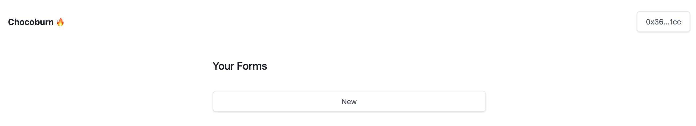
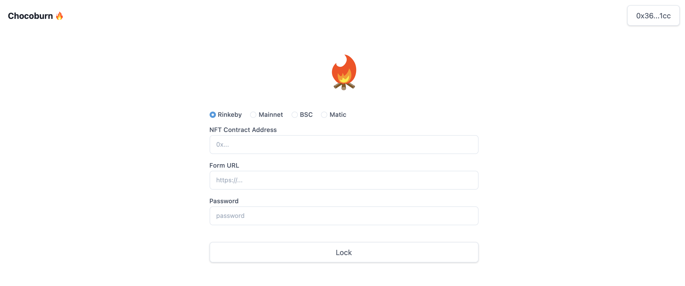
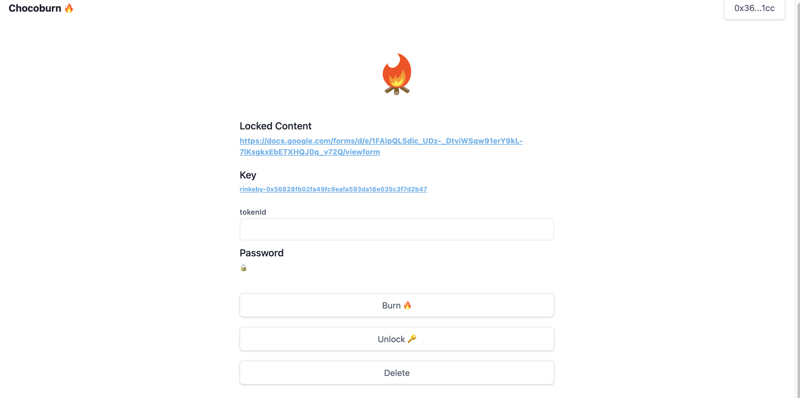
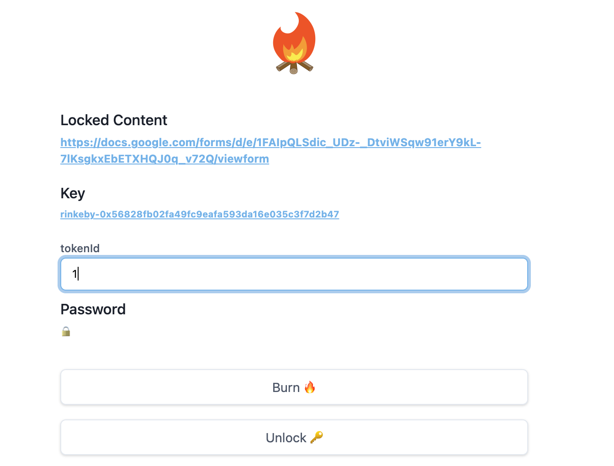
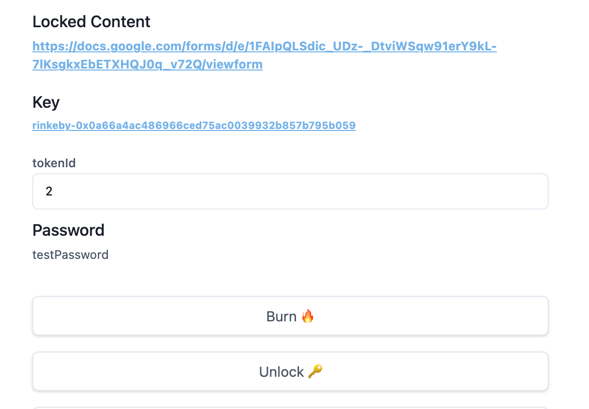

# 日本語

Chocoburnは、NFTをバーンした人にだけパスワードを共有できるサービスです。  
「NFTをバーンすると手に入るコンテンツ」のようなNFTを作ることができます。

## ロックをかける

[https://burn.chocomint.app/signin](https://lock.chocomint.app/signin)

サインインページでウォレットを接続してサインインしてください。

New ボタンから新規にロックを作ります。

① Chocoburnに使用するNFTがあるチェーンを選択   
② Chocoburnに使用するNFT Contract Addressを入力  
③ VimeoやZoomなど、パスワードをかけられる外部サービスのURLを入力   
④ ③のコンテンツに必要なパスワードを入力

Lockボタンを押してlockを作成します。

成功すると画面が遷移します。

こちらのページでNFTをバーンし、passwordを復号することができます。URLをNFTホルダーの方に案内してください。

## ロックを解除する

自分の所有しているトークンIDを入力し、Burnボタンを押して、ウォレットで署名してトークンをバーンします。

トランザクション成功を待ち、Unlockボタンを押してください。過去にBurnしたことがあるユーザーのみUnlockに成功し、Passwordが表示されます。

