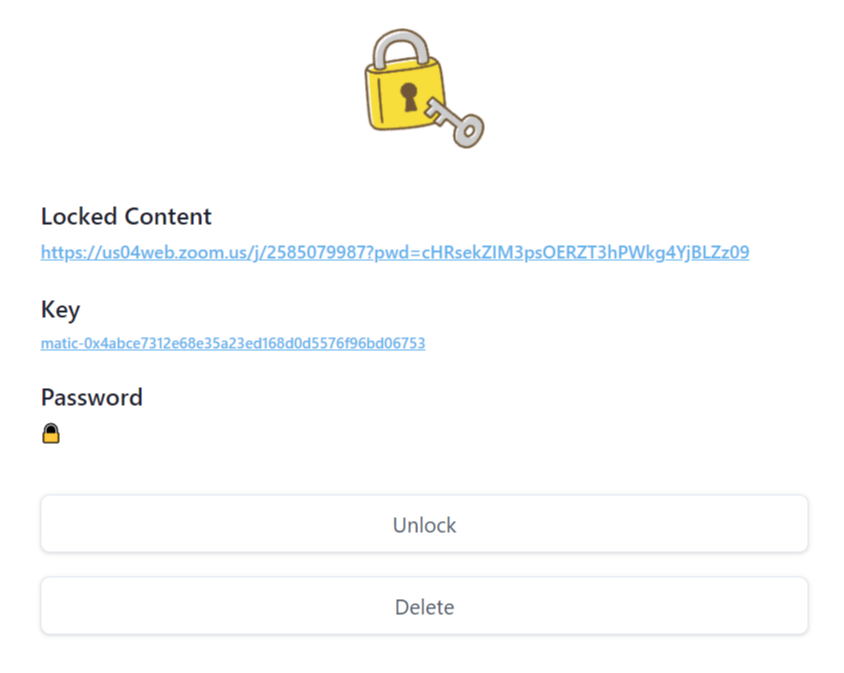

# English

"Chocolock" is a service that can display the password to those who have the designated NFT.

## Lock

[https://lock.chocomint.app/signin](https://lock.chocomint.app/signin)

Please connect your Web3.0 wallet and sign in from this page.

①　Select Network you want to use.

②　Input NFT contract address.

※If you can't find NFT contract address, check here.

[https://www.notion.so/Chocogift-11b3cd6cc7324c4ebfa17b19a2b58428](https://www.notion.so/Chocogift-11b3cd6cc7324c4ebfa17b19a2b58428)

③　Input the URL of an external service that can be password-protected.

④　Input a password used for ③.

☆New feature☆

You can now specify the "Chocolock" key for each token.

Input the Token IDs

Only those who have the NFT of the Token IDs entered here can check the password.

If left brank, everyone who has the NFT of the designated NFT Contract address can check the

password.

Click the "Lock" button when you are done.

The URL of ③ is displayed in "Locked Content", and the NFT Contract Address required to obtain "Password" is displayed in "Key".

## Unlock

Connect your Web 3.0 wallet that have the designated NFT.

When you click the "Unlock" button, the password will be displayed as shown in the picture below.

On the other hand, if you don't have the designated NFT, an error message will be appeared.

Therefore, only those who have the designated NFT can check the password.

For more info, please contact us on [\*\*dicord](https://discord.gg/EaCUBgAu)!\*\*

